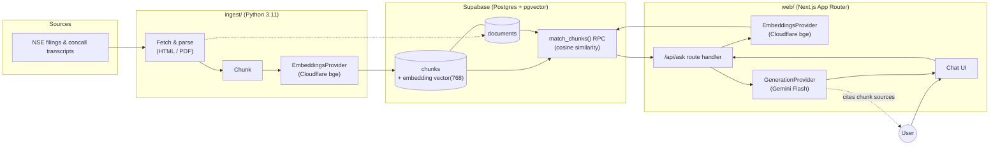

# ARCHITECTURE

Status: **Accepted**
Date: 2026-08-16

This is an Architecture Decision Record (ADR) for the concall-intelligence
monorepo: what we're building, the stack we've pinned, the constraint that
shaped every choice, and how data flows through the system end to end.

## 1. Goal

Source-cited question answering over two classes of Indian-market documents:

- **NSE filings** — corporate announcements and disclosures filed with the
  National Stock Exchange (results, corporate actions, material events).
- **Earnings-call transcripts** — the Q&A and management commentary from
  quarterly concalls.

A user asks a question about a company ("What did management say about
margin guidance last quarter?") and gets an answer that **quotes or cites
the specific filing/transcript passage(s)** it's grounded in — never an
answer synthesized from the model's general knowledge alone. Retrieval must
be able to point back to a source document and location for every claim.

## 2. Constraint: ₹0

The project runs entirely on free tiers. This is not a soft preference —
it is the constraint that eliminated every alternative below. Concretely:

- No paid compute, no always-on paid database, no paid vector store.
- No paid embedding or generation API. Free-tier rate limits are acceptable
  and expected; the pipeline is designed to run in small batches
  (scheduled/on-demand ingestion, not real-time streaming) to live inside
  them.
- Hosting for both the ingestion job and the web app must fit a free tier
  (e.g. Vercel's hobby tier for `web/`, and any free scheduler/runner —
  GitHub Actions, a local cron, etc. — for `ingest/`).

Every "pinned stack" decision in §3 was made by asking "what free tier
covers this with the least glue code?", not "what's best in the abstract."
If a free tier disappears or its limits become unworkable, the fix is a new
provider implementation behind the existing interface (§3.2, §3.3) — not a
rearchitecture.

## 3. Pinned stack

### 3.1 Storage & retrieval: Supabase (Postgres + pgvector)

**Decision:** Supabase's free-tier Postgres, with the `pgvector` extension
for embedding storage and cosine-similarity search via an RPC
(`match_chunks` — see [`supabase/migrations/20260816162557_init_schema.sql`](supabase/migrations/20260816162557_init_schema.sql)).

**Why:** One free-tier database serves as both the relational store
(documents, metadata, symbols, publish dates) and the vector index — no
separate vector DB, no separate metadata DB, no sync problem between them.
Supabase additionally gives us a hosted Postgres instance, a REST/RPC layer,
and row-level security for free, which a bare self-hosted Postgres wouldn't.

**Alternatives considered:** A dedicated vector DB (Pinecone, Weaviate,
Qdrant Cloud) — rejected because free tiers are small, and it doubles the
number of systems to keep in sync for no retrieval-quality benefit at this
scale. SQLite + a local vector index — rejected because it doesn't survive
serverless deploys (`web/` needs a persistent, network-reachable store).

### 3.2 Embeddings: Cloudflare Workers AI (`bge-base-en-v1.5`), behind a provider interface

**Decision:** Cloudflare Workers AI's free tier (10,000 neurons/day) running
`@cf/baai/bge-base-en-v1.5` (768-dim) is the pinned default embedding model,
reached through an `EmbeddingsProvider` interface implemented identically in
both packages:

- Python: [`ingest/src/ingest/providers/embeddings.py`](ingest/src/ingest/providers/embeddings.py)
- TypeScript: [`web/src/lib/providers/embeddings.ts`](web/src/lib/providers/embeddings.ts)

**Why the interface, given it's pinned:** The ingestion pipeline embeds
documents at write time; the web app embeds the user's question at query
time. Both **must** use the same model and dimensionality, or similarity
search is meaningless — so the interface exists to make that invariant
structural (one `dimensions` value, one call shape) rather than a
convention two codebases have to remember to keep in sync. It also isolates
the one free-tier dependency (daily neuron quota) most likely to need a
fallback provider if usage grows past it.

### 3.3 Generation: Gemini Flash (free tier), behind a provider interface

**Decision:** Google's Gemini Flash free tier is the pinned default answer-
synthesis model, reached through a `GenerationProvider` interface:

- Python: [`ingest/src/ingest/providers/generation.py`](ingest/src/ingest/providers/generation.py)
- TypeScript: [`web/src/lib/providers/generation.ts`](web/src/lib/providers/generation.ts)

**Why:** Gemini Flash's free tier is generous enough for a low-traffic Q&A
app and fast enough for interactive use. The provider interface exists for
the same reason as §3.2 — free-tier terms and limits are the least stable
part of a ₹0 architecture, so the call site (`web/src/app/api/ask/route.ts`)
depends on an interface, not a vendor SDK.

### 3.4 Ingestion: Python 3.11

**Decision:** `ingest/` is a Python 3.11 package (installable via `uv` or
plain `pip`) responsible for fetching NSE filings and transcripts, parsing
them (HTML/PDF), chunking, embedding (§3.2), and writing to Supabase (§3.1).

**Why Python for this half:** document parsing (PDF text extraction, HTML
scraping of NSE's filing pages) has the deepest, most reliable library
support in Python. Keeping ingestion as a separate, independently
runnable package — rather than Next.js API routes or a cron'd serverless
function — means it can run anywhere free (a local machine, a GitHub
Actions schedule) without being coupled to the web app's deploy target or
runtime limits.

### 3.5 Web app: Next.js (App Router, TypeScript)

**Decision:** `web/` is a Next.js App Router app in TypeScript, deployed to
a free hosting tier (e.g. Vercel hobby). It owns the query-time path: accept
a question, embed it (§3.2), run `match_chunks` against Supabase (§3.1),
call the generation provider (§3.3) with the retrieved, cited chunks, and
return a grounded answer.

**Why:** App Router Route Handlers give a natural home for the `/api/ask`
server-side RAG endpoint without a separate backend service — one deploy
target for the whole user-facing surface, which matters for staying inside
a single free hosting tier.

## 4. Data flow

**Write path (offline, `ingest/`):** fetch a filing or transcript → parse to
text → chunk → embed each chunk (Cloudflare bge, 768-dim) → write
`documents` + `chunks` rows to Supabase.

**Read path (online, `web/`):** user submits a question → `/api/ask` embeds
it with the same provider → `match_chunks` RPC does cosine-similarity
search over `chunks` → top-K chunks (each carrying their source document)
go into a prompt → Gemini Flash generates an answer instructed to cite only
those chunks → UI renders the answer with its source citations.

## 5. Consequences

- Both packages must stay pinned to the same embedding model and
  dimensionality (see the `vector(768)` column in
  [`supabase/migrations/20260816162557_init_schema.sql`](supabase/migrations/20260816162557_init_schema.sql)) — changing the
  embedding model requires a migration and a full re-embed, not just a
  config flip.
- Free-tier rate limits (Cloudflare neurons/day, Gemini requests/day,
  Supabase connection/row limits) bound both ingestion batch size and
  expected web traffic. This is acceptable for the project's current scope;
  revisit if usage grows.
- Provider interfaces (§3.2, §3.3) are the intended extension point if a
  free tier changes terms — implement a new class, flip an env var
  (`EMBEDDINGS_PROVIDER` / `GENERATION_PROVIDER`), no call-site changes.
